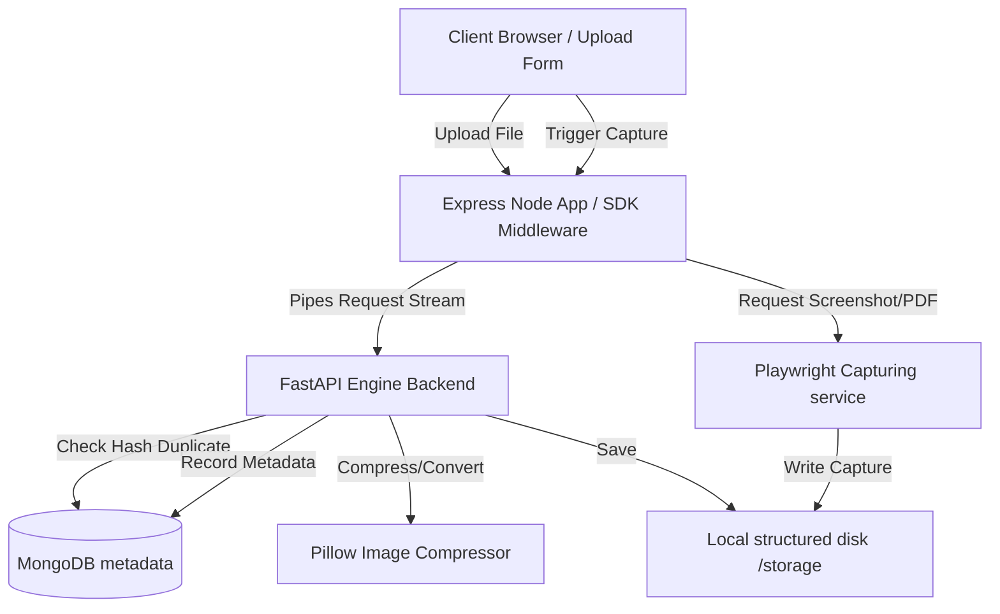

# 🚀 SmartUploader Engine

> **"Streaming-first File Processing Engine & Self-hosted Cloud with Built-in Browser Automation"**

SmartUploader is a modern, high-performance replacement for traditional file uploaders (like Multer) coupled with a powerful self-hosted processing server. It streams files directly from request streams to a background FastAPI engine, processes them on-the-fly, saves them to structured directories, checks for duplicate uploads via hash matching, and provides Playwright-based website capturing.

---

## ⚡ Key Features

* **Zero-RAM & Zero-Disk Streaming (Busboy)**: Bypasses memory buffering and temp storage on Node.js middleware. Files are piped on-the-fly directly to the processing server.
* **On-the-fly Image Compression**: Auto-converts files (e.g. PNG/JPG to WebP) and performs size-reduction quality settings automatically.
* **Smart Duplicate Detection**: Scans file hashes against MongoDB to identify existing resources, serving existing files instantly and saving disk space.
* **Built-in Automation Engine (Playwright)**: Capture URLs as full A4 PDF documents or PNG screenshots instantly via a clean API.
* **Structured Storage Layout**: Files are automatically stored by mime-types (`images`, `videos`, `docs`, `temp`).
* **Production Ready CI/CD**: Ready-to-go GitHub actions validating backend linters and SDK packages.

---

## 🏗️ Architecture



---

## 📦 SDK Installation (Node.js/Express)

```bash
npm install uploadx
```

### Express Usage

```javascript
const express = require('express');
const upload = require('uploadx');

const app = express();

// Single file upload (zero disk/RAM usage)
app.post('/upload', upload.single('file', {
  compress: true,
  autoFormat: true,
  maxSize: '100MB'
}), (req, res) => {
  // req.file contains the metadata returned from the storage cloud
  res.json(req.file);
});

// Multi-file upload
app.post('/upload-multi', upload.array('files', 5, {
  compress: true
}), (req, res) => {
  res.json(req.files);
});

app.listen(3000, () => console.log('Server running on port 3000'));
```

---

## ⚡ FastAPI Engine Configuration (`engine/`)

### Setup and Launch

1. **Install system dependencies** (Ensure `ffmpeg` is present for video conversions):
   ```bash
   sudo apt install ffmpeg -y
   ```

2. **Setup virtual environment & run**:
   ```bash
   cd engine
   python3 -m venv venv
   source venv/bin/activate
   pip install -r requirements.txt
   playwright install chromium
   python main.py
   ```

3. **Environment variables (`.env`)**:
   ```ini
   MONGODB_URL=mongodb://localhost:27017
   DATABASE_NAME=smart_uploader
   STORAGE_ROOT=./storage
   PUBLIC_BASE_URL=http://localhost:8000
   ```

---

## 🦾 Playwright Web Capturing API

Generate screenshots or PDFs directly using the SDK wrapper or endpoint:

```javascript
const axios = require('axios');
const uploadx = require('uploadx');

// Trigger website screenshot capture
axios.post(`${uploadx.engineUrl}/automation/capture`, {
  url: 'https://news.ycombinator.com',
  format_type: 'screenshot' // or 'pdf'
}).then(res => {
  console.log('Capture Short URL:', res.data.data.url);
});
```

---

## 🛠️ Serving Optimizations (Nginx)

In production, avoid serving files via Python/FastAPI. Direct Nginx to serve the structured storage root:

```nginx
server {
    listen 80;
    server_name yourdomain.com;

    # UploadX static storage server
    location /f/ {
        alias /var/www/uploadx/storage/;
        expires 30d;
        add_header Cache-Control "public, no-transform";
    }

    # Proxy upload/meta requests to FastAPI
    location / {
        proxy_pass http://localhost:8000;
        proxy_set_header Host $host;
        proxy_set_header X-Real-IP $remote_addr;
    }
}
```

---

## 📄 License

This project is licensed under the MIT License - see the [LICENSE](LICENSE) file for details.
